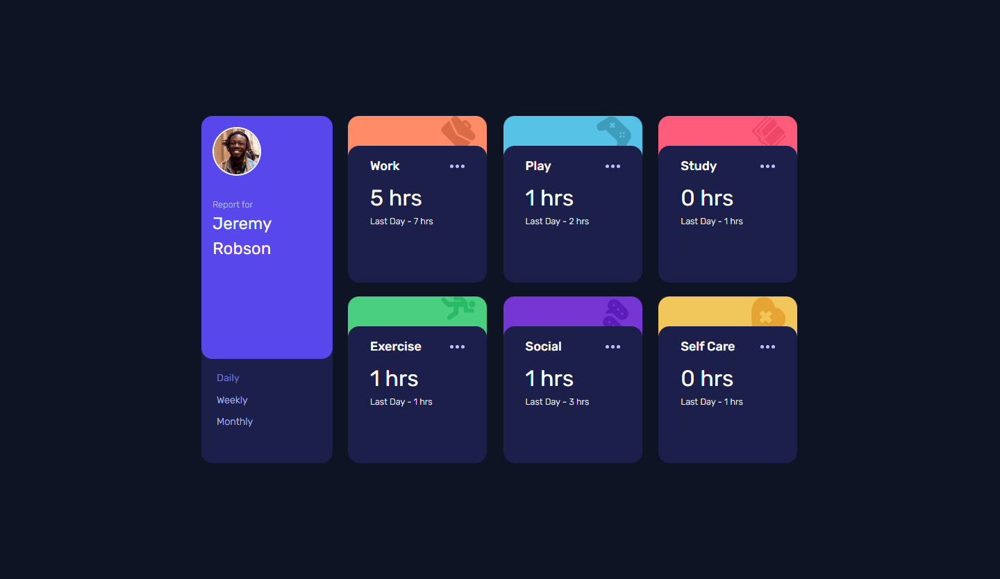
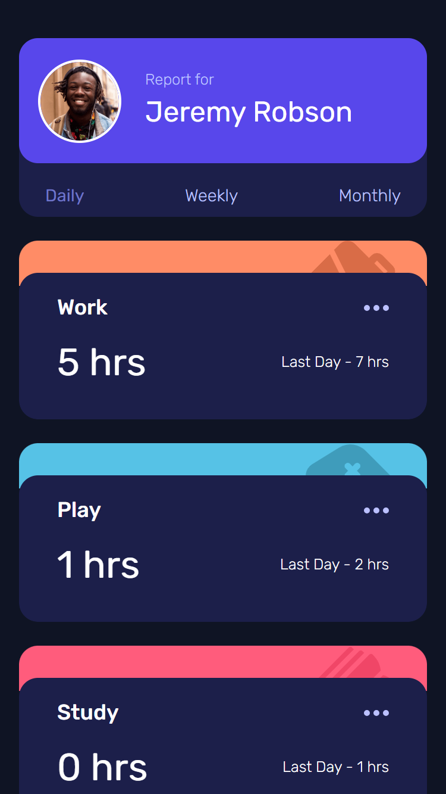

# Frontend Mentor - Time tracking dashboard solution

This is a solution to the [Time tracking dashboard challenge on Frontend Mentor](https://www.frontendmentor.io/challenges/time-tracking-dashboard-UIQ7167Jw). 

### The challenge

Users should be able to:

- View the optimal layout for the site depending on their device's screen size
- See hover states for all interactive elements on the page
- Switch between viewing Daily, Weekly, and Monthly stats

### Desktop Screenshot

### Mobile Screenshot

### Links

- Solution URL: [GitHub](https://github.com/juanmderosa/timetracking-dashboard)
- Live Site URL: [GitHub Pages](https://juanmderosa.github.io/timetracking-dashboard/)

### Built with

- [React](https://reactjs.org/) - JS library
- Semantic HTML5 markup
- CSS custom properties
- Flexbox
- CSS Grid
- Responsive Design workflow

## Author

- Website - [Juan Martín De Rosa](https://juanmderosa-developer.com/)
- Frontend Mentor - [@juanmderosa](https://www.frontendmentor.io/profile/juanmderosa)
- Linkedin - [Juan Martín De Rosa](https://www.linkedin.com/in/juanmderosa/)

